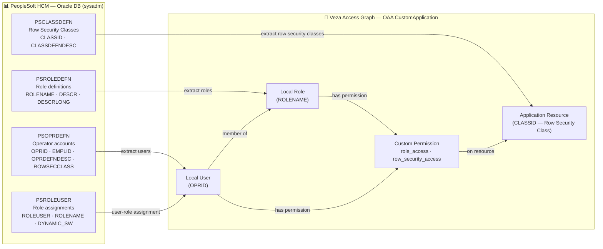

# PeopleSoft HCM → Veza OAA Integration

## Overview

This integration collects identity and permission data from **PeopleSoft Human Capital Management (HCM)** via an Oracle JDBC connection and pushes it into [Veza's](https://www.veza.com) Open Authorization API (OAA). Once ingested, Veza can visualize who has access to PeopleSoft, what roles they hold, and what row-level data they can see — all within the Veza Access Graph.

### What this integration pushes to Veza

| Veza OAA Entity | Source Table | Description |
|---|---|---|
| **Local User** | `sysadm.PSOPRDEFN` | PeopleSoft operator accounts (OPRID) |
| **Local Role** | `SYSADM.PSROLEDEFN` | PeopleSoft role definitions |
| **Application Resource** | `sysadm.PSCLASSDEFN` | Row Security Classes (data-row access scope) |
| **User → Role** | `sysadm.PSROLEUSER` | Static role assignments (`DYNAMIC_SW = 'N'`) |
| **User → Resource** | `PSOPRDEFN.ROWSECCLASS` | Row security class assignment per operator |

### Custom Permissions

| Permission | OAA Standard | Granted via |
|---|---|---|
| `role_access` | DataRead | Membership in a PeopleSoft Role |
| `row_security_access` | DataRead | ROWSECCLASS assignment on the operator |

---

## Entity Relationship Map



---

## How It Works

1. **Load configuration** from `.env` file and/or environment variables (CLI args take highest precedence).
2. **Connect to Oracle DB** via JDBC using `jaydebeapi` and `JPype1` with the `ojdbc11.jar` driver.
3. **Query four tables** in sequence:
   - `PSOPRDEFN` — all operators (users)
   - `PSROLEUSER` — static role assignments (`DYNAMIC_SW = 'N'`)
   - `PSROLEDEFN` — role definitions
   - `PSCLASSDEFN` — row security class definitions
4. **Build OAA payload**:
   - Row Security Classes → Application Resources
   - PeopleSoft Roles → Local Roles (each granted `role_access`)
   - Operators → Local Users, with role memberships and row-security permissions
5. **Push payload** to Veza via `OAAClient.push_application()`.
6. **Write log** to `logs/peoplesoft_hcm_<timestamp>.log` with hourly rotation.

---

## Prerequisites

| Requirement | Notes |
|---|---|
| Python 3.8+ | On the host running this script |
| Java 8+ (JRE) | Required by JPype1/jaydebeapi for JDBC; `JAVA_HOME` must be set |
| Oracle JDBC driver | `ojdbc11.jar` — installed by the installer or from [Maven Central](https://repo1.maven.org/maven2/com/oracle/database/jdbc/ojdbc11/) |
| Network access to Oracle DB | TCP access to `PS_DB_HOST:PS_DB_PORT` from the host |
| Network access to Veza | HTTPS to your Veza tenant URL |
| Oracle read-only account | A DB account (`mimreader` or equivalent) with SELECT on `PSOPRDEFN`, `PSROLEUSER`, `PSROLEDEFN`, `PSCLASSDEFN` |
| Veza API key | Generated in Veza UI: **Admin → API Keys** |

### Required Oracle grants

```sql
-- Grant read-only access to the integration account
GRANT SELECT ON sysadm.PSOPRDEFN    TO mimreader;
GRANT SELECT ON sysadm.PSROLEUSER   TO mimreader;
GRANT SELECT ON SYSADM.PSROLEDEFN   TO mimreader;
GRANT SELECT ON sysadm.PSCLASSDEFN  TO mimreader;
```

---

## Quick Start

```bash
# Download and run the one-command installer (interactive)
bash <(curl -fsSL https://raw.githubusercontent.com/andrewmusto-git/PeopleSoftHCM/main/integrations/peoplesoft-hcm/install_peoplesoft_hcm.sh)
```

> **Note:** Update the URL above with your actual repository URL before distributing.

---

## Manual Installation

### RHEL / CentOS / Amazon Linux

```bash
# System deps
sudo dnf install -y python3 python3-pip java-11-openjdk-headless

# Create service account
sudo useradd -r -s /bin/bash -m -d /opt/VEZA/peoplesoft-hcm-veza pshcm-veza

# Create directory layout
sudo mkdir -p /opt/VEZA/peoplesoft-hcm-veza/{scripts,logs,jdbc}

# Clone or copy integration files
# git clone https://github.com/andrewmusto-git/PeopleSoftHCM.git /tmp/ps-hcm && cp /tmp/ps-hcm/integrations/peoplesoft-hcm/* \
#     /opt/VEZA/peoplesoft-hcm-veza/scripts/

# Download JDBC driver
sudo curl -fsSL \
  https://repo1.maven.org/maven2/com/oracle/database/jdbc/ojdbc11/23.7.0.25.01/ojdbc11-23.7.0.25.01.jar \
  -o /opt/VEZA/peoplesoft-hcm-veza/jdbc/ojdbc11.jar

# Create virtual environment
python3 -m venv /opt/VEZA/peoplesoft-hcm-veza/scripts/venv
/opt/VEZA/peoplesoft-hcm-veza/scripts/venv/bin/pip install -r \
  /opt/VEZA/peoplesoft-hcm-veza/scripts/requirements.txt

# Configure
cp /opt/VEZA/peoplesoft-hcm-veza/scripts/.env.example \
   /opt/VEZA/peoplesoft-hcm-veza/scripts/.env
chmod 600 /opt/VEZA/peoplesoft-hcm-veza/scripts/.env
nano /opt/VEZA/peoplesoft-hcm-veza/scripts/.env
```

### Ubuntu / Debian

```bash
sudo apt-get update
sudo apt-get install -y python3 python3-pip python3-venv openjdk-11-jre-headless
```

---

## Usage

```bash
cd /opt/VEZA/peoplesoft-hcm-veza/scripts
./venv/bin/python3 peoplesoft_hcm.py [flags]
```

### CLI Arguments

| Argument | Required | Default | Description |
|---|---|---|---|
| `--env-file <path>` | No | `.env` | Path to the .env configuration file |
| `--veza-url <url>` | No* | `VEZA_URL` env var | Veza tenant URL |
| `--veza-api-key <key>` | No* | `VEZA_API_KEY` env var | Veza API key |
| `--provider-name <name>` | No | `PROVIDER_NAME` env var | Provider label in Veza |
| `--datasource-name <name>` | No | `DATASOURCE_NAME` env var | Datasource label in Veza |
| `--db-host <host>` | No* | `PS_DB_HOST` env var | Oracle DB hostname |
| `--db-port <port>` | No | `PS_DB_PORT` env var | Oracle listener port |
| `--db-service <svc>` | No* | `PS_DB_SERVICE` env var | Oracle service name |
| `--db-user <user>` | No* | `PS_DB_USER` env var | Oracle DB username |
| `--db-password <pass>` | No* | `PS_DB_PASSWORD` env var | Oracle DB password |
| `--jdbc-driver-path <jar>` | No* | `JDBC_DRIVER_PATH` env var | Path to `ojdbc11.jar` |
| `--dry-run` | No | false | Build payload without pushing to Veza |
| `--save-json` | No | false | Save OAA payload JSON to disk |
| `--log-level` | No | `INFO` | `DEBUG` / `INFO` / `WARNING` / `ERROR` |

> `*` Required; can be supplied via env var or .env file.

### Examples

```bash
# Dry-run with JSON output (safe — no push to Veza)
./venv/bin/python3 peoplesoft_hcm.py --dry-run --save-json --log-level DEBUG

# Push to Veza with default .env
./venv/bin/python3 peoplesoft_hcm.py

# Override env file and datasource name
./venv/bin/python3 peoplesoft_hcm.py --env-file .env.prod --datasource-name "PeopleSoft HCM Production"

# Run preflight checks
bash preflight_peoplesoft_hcm.sh --all
```

---

## Deployment on Linux

### Service account setup

```bash
sudo useradd -r -s /bin/bash -m -d /opt/VEZA/peoplesoft-hcm-veza pshcm-veza
sudo chown -R pshcm-veza:pshcm-veza /opt/VEZA/peoplesoft-hcm-veza
sudo chmod 700 /opt/VEZA/peoplesoft-hcm-veza/scripts
sudo chmod 600 /opt/VEZA/peoplesoft-hcm-veza/scripts/.env
```

### SELinux (RHEL/CentOS)

```bash
getenforce
# If Enforcing:
sudo restorecon -Rv /opt/VEZA/peoplesoft-hcm-veza/
```

### Cron scheduling

Create `/etc/cron.d/peoplesoft-hcm-veza`:

```cron
# PeopleSoft HCM Veza OAA integration — runs daily at 3:00 AM
SHELL=/bin/bash
PATH=/usr/local/sbin:/usr/local/bin:/sbin:/bin:/usr/sbin:/usr/bin
JAVA_HOME=/usr/lib/jvm/java-11-openjdk

0 3 * * * pshcm-veza \
  cd /opt/VEZA/peoplesoft-hcm-veza/scripts && \
  ./venv/bin/python3 peoplesoft_hcm.py >> /opt/VEZA/peoplesoft-hcm-veza/logs/cron.log 2>&1
```

### Log rotation

Create `/etc/logrotate.d/peoplesoft-hcm-veza`:

```
/opt/VEZA/peoplesoft-hcm-veza/logs/*.log {
    daily
    rotate 30
    compress
    delaycompress
    missingok
    notifempty
    create 0640 pshcm-veza pshcm-veza
}
```

---

## Multiple Instances

If you have multiple PeopleSoft environments (dev, UAT, prod), use a separate `.env` file per instance:

```bash
# Production
./venv/bin/python3 peoplesoft_hcm.py \
  --env-file .env.prod \
  --datasource-name "PeopleSoft HCM Production"

# UAT
./venv/bin/python3 peoplesoft_hcm.py \
  --env-file .env.uat \
  --datasource-name "PeopleSoft HCM UAT"
```

Stagger cron jobs by at least 15 minutes to avoid concurrent DB load.

---

## Security Considerations

- `.env` files must be `chmod 600` and owned by the service account.
- Never commit `.env` to version control — add it to `.gitignore`.
- The Oracle account (`mimreader`) should have only `SELECT` privileges on the four tables — no DML, DDL, or admin rights.
- Rotate the Veza API key and DB password on your organization's schedule; update `.env` and restart cron.
- `JDBC_DRIVER_PATH` should point to a JAR file owned by the service account.

---

## Troubleshooting

| Symptom | Likely Cause | Fix |
|---|---|---|
| `ORA-12541: TNS no listener` | Wrong host/port | Check `PS_DB_HOST` and `PS_DB_PORT` |
| `ORA-12154: TNS could not resolve` | Wrong service name | Check `PS_DB_SERVICE` |
| `ORA-01017: invalid username/password` | Bad credentials | Check `PS_DB_USER` / `PS_DB_PASSWORD` |
| `JVMNotFoundException` | Java not found | Set `JAVA_HOME` or install Java 8+ |
| `jaydebeapi.DatabaseError: Class not found` | Bad JDBC JAR path | Check `JDBC_DRIVER_PATH`; verify JAR exists |
| `OAAClientError: 401` | Invalid Veza API key | Regenerate key in Veza UI |
| `OAAClientError: 404` | Wrong Veza URL | Check `VEZA_URL` includes `https://` |
| Missing users | No role assignment | Users with zero roles are still pushed; check `PSROLEUSER` |
| `ModuleNotFoundError: oaaclient` | Venv not activated | Use `./venv/bin/python3` not system `python3` |

---

## Changelog

### v1.0.0
- Initial release
- Oracle JDBC connectivity via `jaydebeapi` + `JPype1`
- Pushes Operators, Roles, and Row Security Classes to Veza OAA
- Interactive Bash installer with 10-step milestone progress
- Preflight validation script
